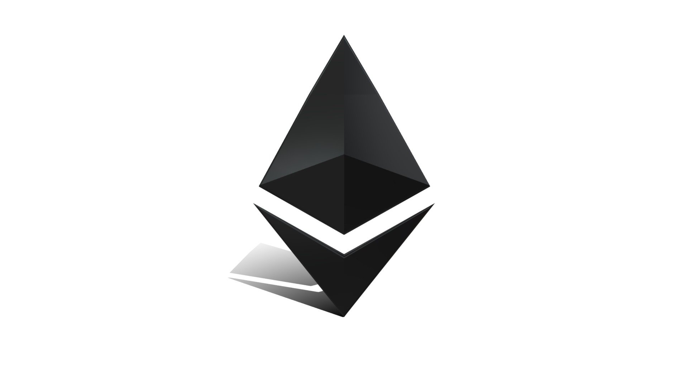
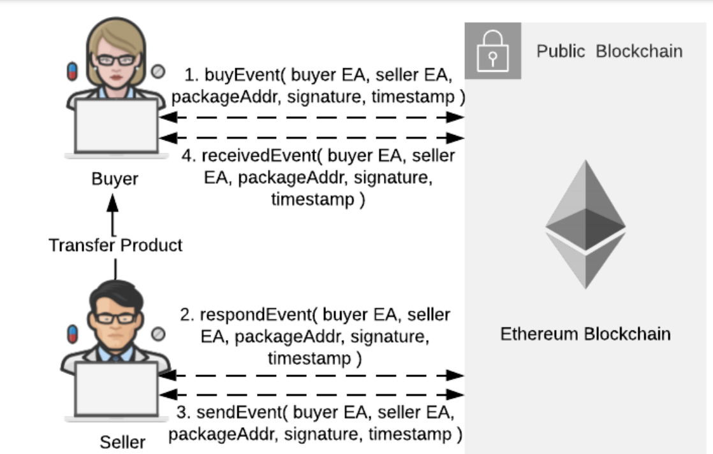
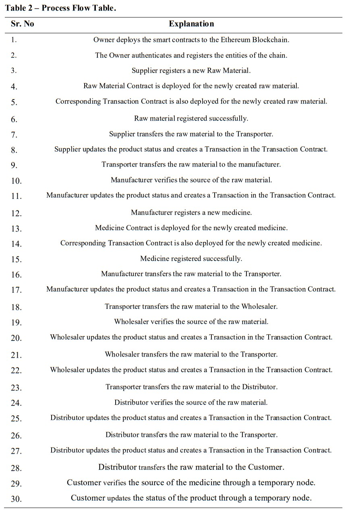
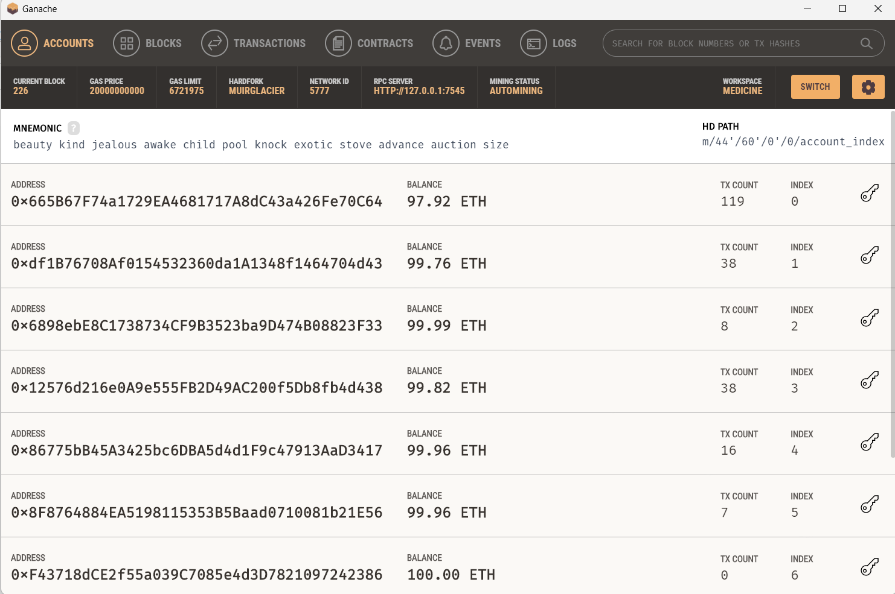
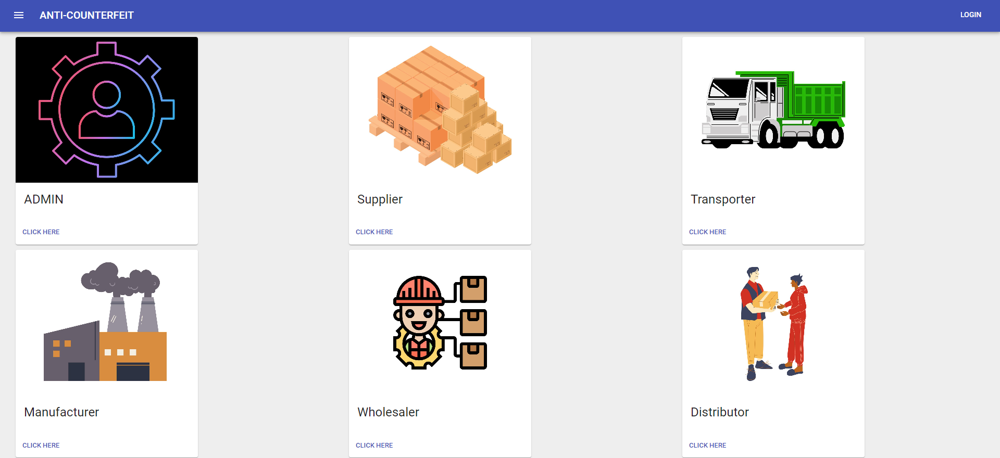
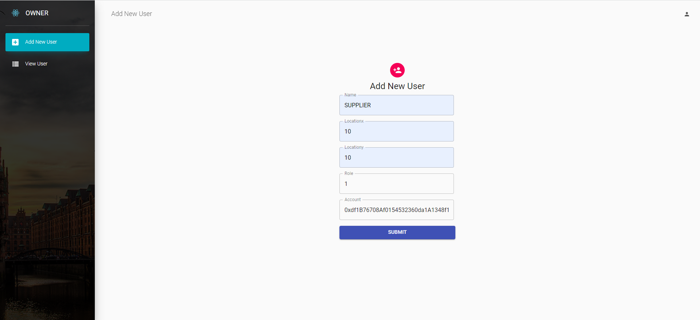
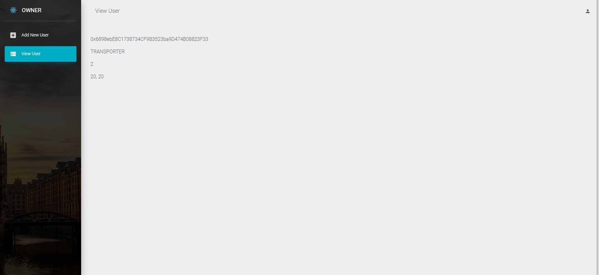
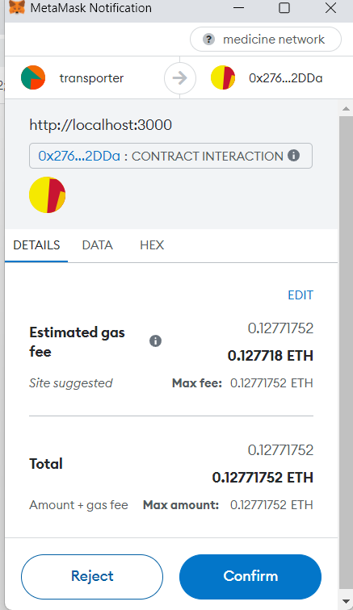
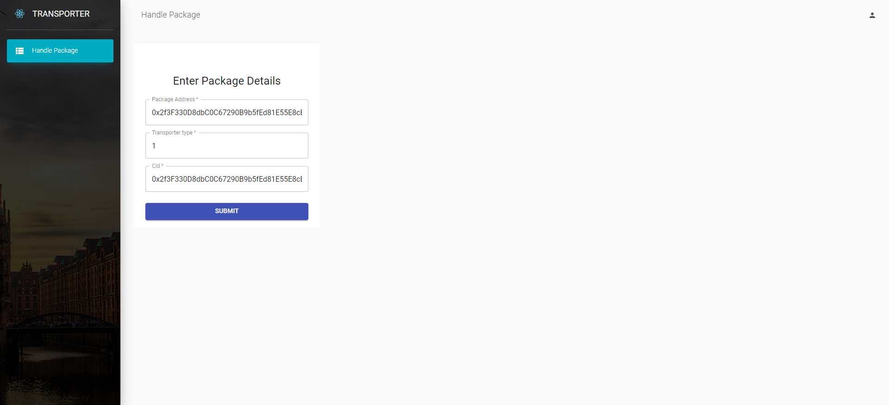
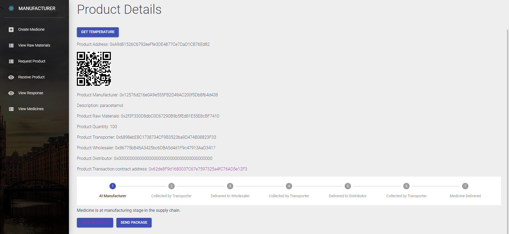

<!-- PROJECT LOGO -->
<a name="readme-top"></a>
<br />
<div align="center">
  <a href="https://gat.ac.in/">
    
  </a>

  <h3 align="center">Counterfeit Medicine Authentication System</h3>

  <p align="center">
  The counterfeit medicine authentication system using blockchain and IoT is a technology-based solution designed to verify the authenticity of medications and prevent the distribution of counterfeit drugs. This system leverages the benefits of blockchain and IoT technologies to create a more secure and transparent supply chain for pharmaceutical products.
    <br />
    <a href="https://github.com/appuabhishek/counterfeit-medicine"><strong>Explore the docs »</strong></a>
    <br />
    <br />
    
    
   </p>
</div>

## ⏯️ Explanation + Demo Video(click image)

<a href="https://youtu.be/uSbdB0vDNeA"></a>


<!-- ABOUT THE PROJECT -->
## ⚛️ ABOUT THE PROJECT
The pharmaceutical supply chain network is the mechanism by which manufactured prescription medications are distributed to patients. However, this supply chain is very complex and consists of multiple stages, which could span over months or longer, across multiple regions around the world. A primary supply chain consists of many entities like suppliers, manufacturers, transporters, wholesalers, distributors, retailers, etc. Thus, keeping track of each medical drug throughout the chain and tracing it back to its source becomes a tedious job. Drug counterfeiting is a global concern. The Health Research Funding organization reported that nearly 10-30% of the drugs are fake in developing countries. Counterfeit products are a matter of great concern as they can produce different side effects to human health. According to the World Health Organization, about 30% of all medication sold in Africa, Asia, and Latin America is counterfeit. The key problem is not counterfeiting, but rather the fact that, as opposed to real medications, counterfeit drugs have different side effects on human health.

Due to lack of transparency in the current system, it is extremely difficult for customers or buyers to know the value of the products. It is also very difficult to investigate the tampering within the supply chain when there is suspicion of illegal or unethical practices. Hence such supply chains are highly inefficient as vendors, suppliers, etc. try to establish a link among the entities and identify who needs what, when and how. Customers and buyers are currently unable to determine the true worth of goods due to a major lack of clarity in the current system. When there is evidence of improper or immoral activities, this tampering within the chain is exceedingly difficult to investigate. They can also be unreliable as retailers and manufacturers struggle to figure out who wants what, when, why, and how. Blockchain is a revolutionizing solution.

Blockchain provides a distributed hyperledger with no centralized authority over the system. Each transaction into the blockchain is immutable, which means there is no way sensitive data like Drug/Customer information can be tampered with. Blockchain provides complete transparency, which also brings trust between the various main entities of the Supply Chain, such as, Manufacturers, intermediaries like Distributors and Suppliers, and the end-users like Customers/Retailers/Hospitals. Each product within the chain can be transferred between the different authenticated entities of the chain using an event request-response mechanism. All transactions between the different entities are recorded into the blockchain using smart contracts.


<p align="right">(<a href="#readme-top">back to top</a>)</p>

<!-- SYSTEM DESIGN -->
## 💻 SYSTEM DESIGN


## ⚡ Smart Contract Design

Supply Chain Contract: This contract is deployed by the Owner of the chain. It consists of many entities associated with the supply chain, i.e., Owner, Supplier, Transporter, Manufacturer, Wholesaler, Distributor, Customer. It also consists of various Solidity events used to communicate with the front end in real-time. Each function in the contract can only be accessed by its respective role assigned to it. This is done with the help of "modifiers" in Solidity. Thus, no entity without a particular role can access a specific function. This helps to increase the security and accessibility of data stored or queried from the blockchain.

Raw Material Contract: A respective Supplier deploys the Raw Material Contract. Once a raw material is created physically, it is then added to the chain by the supplier that created the raw material. While creating a raw material to be added to the chain, data such as EA (Ethereum Address) of the Supplier, DateTime, EA of Transporter, Transaction Contract Address, etc. are requested from the supplier. It also contains events that can compute the whereabouts of the package in real-time. The EA of Receiver (Manufacturer) is later updated based on the event request-response mechanism. It also stores the current status of the medicine, i.e., which entity currently has the raw material.

Medicine Contract: The respective manufacturer deploys the Medicine Contract. Once a medicine is created physically, it is then added to the chain by the manufacturer that created the medicine. While creating medicine to be added to the chain, data such as EA (Ethereum Address) of Raw Material used to create medicine, DateTime, EA of Transporter, Transaction Contract Address, etc., is requested from the manufacturer. It also contains events that can compute the whereabouts of the package in real-time. The EA of Wholesaler, EA of Distributor, and EA of Customer are updated later based on the event request-response mechanism. It also stores the current status of the medicine, i.e., which entity currently has the package.

Transaction Contract: The Transaction Contract is deployed automatically by the Raw Material and Medicine smart contracts whenever created. The contract takes data such as DateTime, sender EA, receiver EA, location, transaction hash, and the hash of the previous transaction. The transaction hash is 32 bytes. The previous transaction hash is stored for entities to verify the source of products in the chain—an example of transaction data in the smart Transaction contract.


   <br />

<p align="right">(<a href="#readme-top">back to top</a>)</p>

<!-- PROCESS FLOW -->
## 📝 PROCESS FLOW


## 🐱‍💻 PREREQUISITES

1.ETHEREUM ACCOUNT

2.GANACHE SOFTWARE

3.NODE MODULES

4.YARN PACKAGE MANAGER

5.REACT DEVELOPMENT ENVIRNOMENT (VISUAL STUDIO CODE)

<p align="right">(<a href="#readme-top">back to top</a>)</p>

<!-- GETTING STARTED -->
## 👀 Getting Started

### ⛏️  To deploy the Smart Contract

1. Install Ganache and create a workspace.
2. Install Truffle npm package globally by running ```npm install -g truffle```.
3. In the `truffle-config.js` file update the `from:` address to an address from your Ganache workspace.
4. Run ```truffle migrate --reset``` from the command line to deploy the smart contract to the blockchain.
5. Download Metamask Chrome extension for the browser to help interaction between the application and the blockchain.


### 🪜 STEPS TO RUN REACT DEVELOPMENT SERVER
  
  ```sh
   npm install
   npm start
   ```


<p align="right">(<a href="#readme-top">back to top</a>)</p>

  
 ## :octocat: Project GitHub Links:
- <a href="https://github.com/appuabhishek/counterfeit-medicine">Smart Contracts for Blockchain + Frontend </a>
- <a href="https://github.com/appuabhishek/tempreature-api.git">IoT part</a>

## 📈 RESULTS

   <br />
    
   <br />

   <br />

   <br />
   
   <br />
     
   <br />
      
   <br />
  
## 🔥 Our Published Paper Link:
<a href="https://ieeexplore.ieee.org/document/10170622" target="_blank">https://ieeexplore.ieee.org/document/10170622</a>


## License

[](https://opensource.org/licenses/MIT)

[MIT License Link](https://github.com/appuabhishek/counterfeit-medicine/blob/master/LICENSE)


